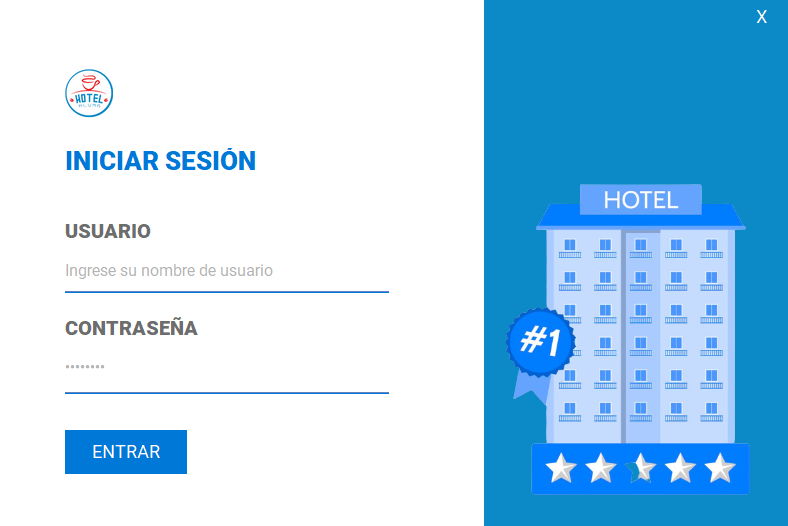
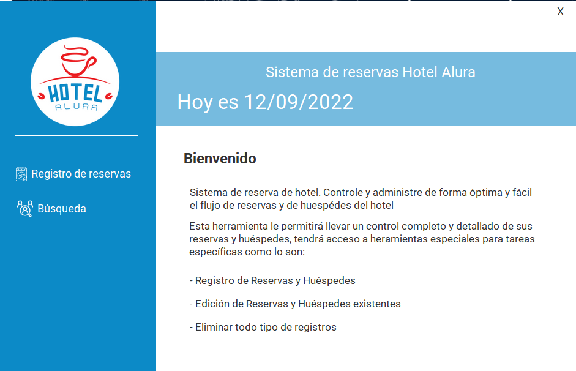
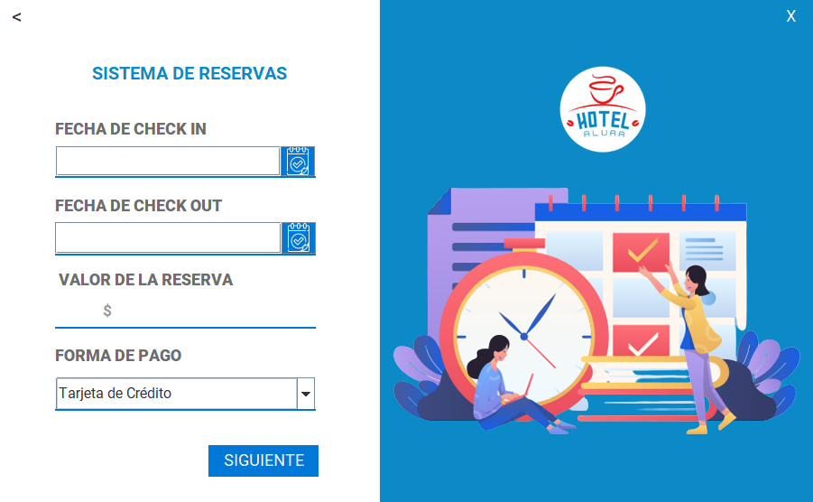
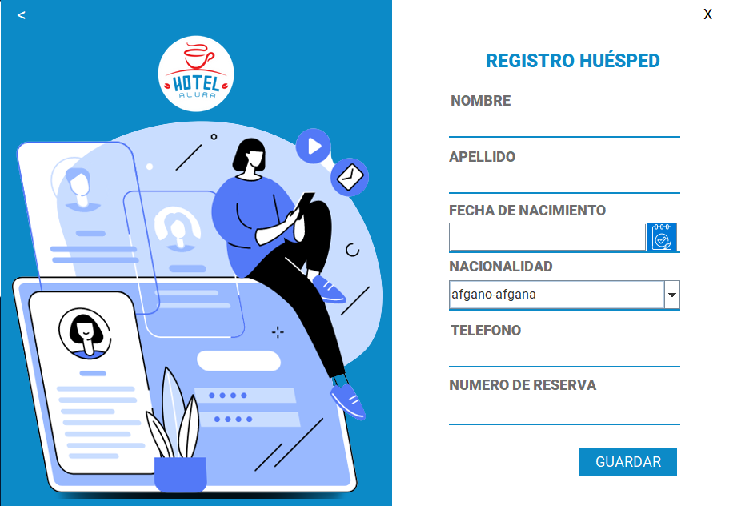
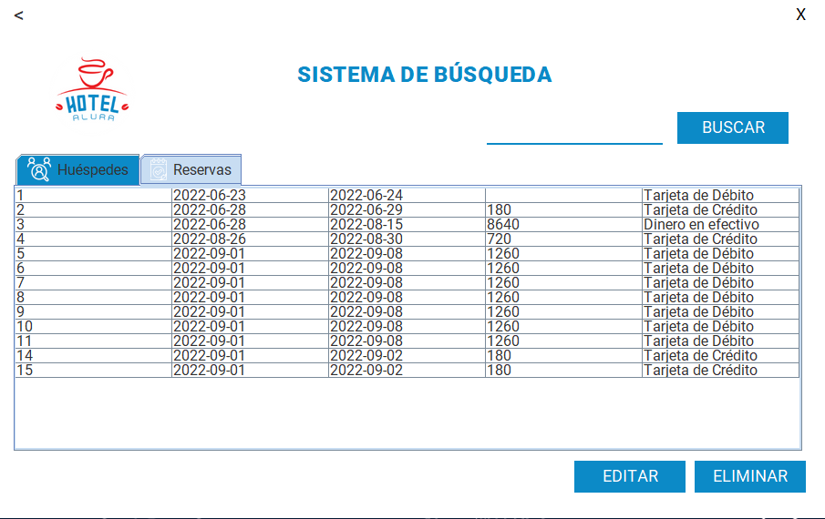

# Challenge ONE | Java | Back-end | Hotel Alura

     

## 🚧 Proyecto

     

#### En el inicio se puede ingrresar a la ventana de Login para poder realizar la reserva

## Login

Para poder ingresar en el Login se debe utilziar:
#### usuario: admin
#### password: 123546

     

## Ventana Usuario

#### En esta ventana se presentarán las opciones cuando el usuario autenticado está dentro del sistema, tienes las siguientes opciones:

<ul>
     <li>Reservar: Deve llevar a la ventana de Reservas</li>
     <li>Búsqueda: Deve llevar a la ventana de Sistema de búsqueda.</li>
     <li>Salir del Sistema: Deve llevar a la ventana de Login</li>
</ul>

     

## Registro de reservas

#### La ventana de Reservas debe permitir al usuário registrar los siguientes datos:
<ul>
     <li>Día de Entrada</li>
     <li>Día de Salida</li>
     <li>Valor de la reserva, que será calculado en base a un valor de diaria fijo que tú mismo podrás elegir.</li>
     <li>Forma de Pago donde el usuário podrá elegir entre:</li>
     <ul>
          <li>Tarjeta de crédito</li>
          <li>Tarjeta de débito</li>
          <li>Dinero en efectivo</li>
     </ul>
     <li>Botón continuar</li>
</ul>

     

## Registro de huesped
#### Esta sección tendrá los datos personales de los huéspedes con los siguientes campos:
<ul>
     <li>Nombre</li>
     <li>Apellido</li>
     <li>Fecha de Nacimiento</li>
     <li>Nacionalidad</li>
     <li>Teléfono</li>
     <li>Número de reserva que fue generada anteriormente.</li>
</ul>

     

## Busqueda
En esta ventana se puede editar y/o eliminar reservas y huespedes, a la vez se puede realizar una búsqueda de los mismos.

     

